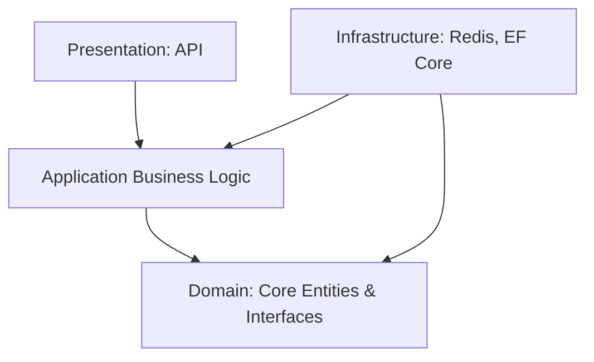

# User Management System (Clean Architecture & Redis)


## 📌 Project Overview
This repository is a practical implementation of **Clean Architecture** and **Redis** integration in a .NET environment. The project focuses on a simple **User Management (CRUD)** system to demonstrate the separation of concerns, high-performance caching strategies, and maintainable code structure.

---

## 🎯 Key Objectives
- **Practice Clean Architecture**: Implement distinct layers (Domain, Application, Infrastructure, API) to ensure the system is independent of external dependencies.
- **Master Redis Caching**: Leverage Redis for efficient data caching to optimize read operations and improve response times.
- **RESTful API Development**: Build a standard CRUD interface using the latest .NET features.

## 🛠️ Technology Stack
- **Framework**: [.NET 10](https://dotnet.microsoft.com/)
- **Database Architecture**: Clean Architecture
- **Caching**: [Redis](https://redis.io/)
- **API Documentation**: Swagger (OpenAPI)
- **Data Persistence**: Entity Framework Core (planned)

---

## 🏗️ Project Structure
The solution follows the Clean Architecture pattern, divided into four main layers:



- **DOMAIN**: The innermost layer. Contains core entities, interfaces, and domain-specific logic. Independent of all other layers.
- **APPLICATION**: Contains business logic, DTOs, and Service/Repository interfaces.
- **INFRASTRUCTURE**: Implements interfaces defined in the Application layer. Manages database context, Redis client, and external service integrations.
- **API**: The entry point (ASP.NET Web API). Handles HTTP requests and dependency injection registration.

---

## 🚀 Getting Started
1. **Prerequisites**:
    - Install .NET 10 SDK.
    - Setup a Redis instance (local or Docker).
2. **Installation**:
    ```bash
    git clone https://github.com/maaitlunghau/dotnet-user-management-clean-architecture-redis.git
    cd dotnet-user-management-clean-architecture-redis
    dotnet restore
    ```
3. **Run the API**:
    ```bash
    cd API
    dotnet run
    ```

---

## 👤 Author
**maaitlunghau**
- **Email**: [trunghau@mstsoftware.vn](mailto:trunghau@mstsoftware.vn)
- **Work**: MST SOFTWARE

*"Learning by doing – Practicing Clean Architecture and Redis for better scalability."*
